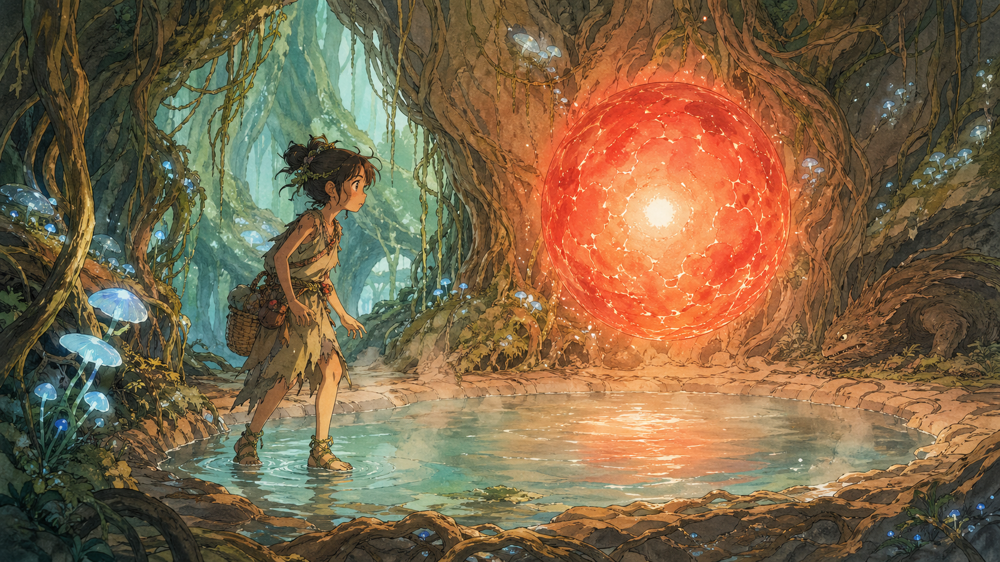

# 第二章 暗期之上

她本来只是想出去看一眼。

推门得慢。门轴那段干藤条推快了会嘎吱响。藤鞋底软，踩在地板上几乎没声。到了门口，露维停了一下，回头看了一眼。安洁丽雅缩在睡袋里，只露出半张脸，呼吸很浅很慢。

矮凳上放着她们的粮袋。露维蹲下来，摸了摸袋口，从里头掏出一包干菌，阔叶裹的，藤绳绕两圈半打了个死结，丽雅的手法。手都收回来了，丽雅白天那句"别又空着肚子跑"又冒出来。她犹豫了一下，还是多抓了一把散的塞进藤绳袋里。

带子勒上肩膀，刮片别在腰上。露维没有往外钻，只先贴到聚落内侧的藤网边，藤鞋底贴着树皮。

藤网边比屋里冷，湿气从鞋底边缘渗上来。西边的叶雾里又亮了一下，橘色的，很短，像有什么东西在远处眨了一下眼。

隔着藤网站了一会儿，风从下面的叶层吹上来，凉的，带着菌雾的湿气。暗期的聚落外面其实很安静。没有格里朗说的那些东西。至少现在没有。没有叫声，没有影子。只有远处那道没见过的颜色，还有阿岩白天那句"雾厚"。

她把手指伸进藤网的缝里，又抽回来。那一线橘色的位置不偏不斜，就在第三处树杈那一带，她的甜瓜也在那里；要真过去，就得穿过须根丛，中间那段完全没有冷光菌。白天走过是一回事，暗期走过去又是另一回事。空着手钻出去，最多也只能在藤网外面站一会儿。

那道橘光又在西边闪了一下，比刚才更低，像落到了叶雾下面。露维想起去年那颗被钩爪猴啃烂的瓜，连皮都烂了，丽雅专门去看过，回来只说一句"没救了"。等到亮时，什么都晚了。她咬了一下嘴唇，须根丛的暗区太长了，不带萤瓶过不去。

露维从藤网边退回屋影里。

莫砾的屋子在南侧藤网边上三间。墙根的阴影里，她往屋里看了一眼。屋里没光，门没关严，一条手指宽的缝。莫砾在打呼噜，隔着藤编墙都听得见，粗重的一声接一声，偶尔断一拍，断完了继续。

那个树脂匣子就在门口矮凳上。矮凳，门边，盖子朝上，和每个暗期一样。露维从八岁那次被提着后领罚站之后就没碰过它。七年了。她甚至走路经过莫砾门口都会不自觉地绕半步。

露维蹲在莫砾门边，数着他打呼噜的节拍。吸——停——呼。三拍一轮，很稳，停的那一拍最长，大概两息。她在第三个"停"的时候伸手。

匣子的树脂盖滑腻腻的，指尖碰上去有一层莫砾手上的菌泥油。盖子不能掀，一掀会有很轻的"啪"一声。手从侧面的缺口探进去。萤瓶排得很紧，大小不一，指尖在瓶壁上滑过去，碰到一个最小的。小指粗，矮矮胖胖的一截，瓶里的萤虫还在微弱地浮动。她夹住瓶身，极慢地往外抽。旁边的瓶子轻轻碰了一下，发出一声几乎听不见的"叮"。

莫砾的呼噜断了一拍。露维的手定住了，整个人不敢呼吸。呼噜又续上了，比刚才重了一声。

她把萤瓶抽出来，塞进藤绳袋的最底层，再用干菌包压住。站起来的时候膝盖响了一下，她咬着牙没动，等了五息。莫砾翻了个身，呼噜换了个调，没醒。

露维退到墙根阴影里。手心全是汗。心跳比刚才出门的时候还快。

比起暗期一个人出聚落，偷莫砾的萤瓶才是真正要命的事。被格里朗逮到偷跑出去，最多挨念叨；被莫砾发现少了一瓶，他会一个一个地查，查到是谁拿的，然后站在你面前，什么话都不说，等你自己开口。

袋子底下那一点微亮隔着干菌包闷着，压在她腰侧。现在回去，把瓶子塞回匣子里，睡到亮时，谁也不会知道。可西边那一线橘色已经出现过三次，阿岩白天也看过那边。第三处树杈那颗瓜再过几天就能摘，丽雅该分最大的一片，阿岩也该有一片。要是又只剩一张烂皮，她能气死。

两息之后，露维还是转向南侧旧藤屋后面。那里有个地方藤网编结松了，刚好挤过去一个瘦小孩。她不是第一次钻了。

——阿岩白天看过的也是那一片。他大概知道她会从哪儿翻出去。

挤出去的时候肩膀蹭掉一小块树皮碎屑。聚落外侧的枝干托住了她。

暗期。聚落外面。一个人。腰侧藤绳袋最底层，一瓶偷来的萤虫微弱地亮着，光透过袋子的编织缝隙漏出一点点，像一点被闷住的菌光。

藤鞋底是湿的，风是凉的。露维往西走。

---

脚下是树皮。粗糙，潮湿。藤鞋底压上去会轻轻陷一下，比屋里的藤板软。聚落外面的空气不一样，里面是藤编和菌子的闷味，外面是湿的、凉的，带着叶雾的腥气。夜菌从树皮裂缝里伸出来，泛着极淡的琥珀色，和冷光菌的青白混在一起。好看。好看得她差点忘了自己出来干嘛。

熟悉的路线一路往西。冷光菌簇零星地亮着，刚好够看清前面几步路，再远就被叶雾吞掉了。

前面是须根密集区。须根从主干伸出来向下垂，像一片倒挂的森林。粗的表面渗着水，踩上去滑，旁边的根须得随手带一把。须根之间偶尔能看到更下方。一团灰白色的雾，浓得什么都看不见。

须根丛里几乎没冷光菌。她从袋子底层摸出萤瓶，拧开木塞晃了两下。瓶里三只萤虫被惊醒了，黄晕亮了一点，勉强照出脚前两步的范围。露维把萤瓶举在胸前，另一只手扶着根须往前探。

穿过须根丛是一段窄脊梁。枝干在这里收细了，两侧雾气翻涌，风从两边对着吹过来，冷的，带着深处那种说不清的气味，不难闻，但很远，像从一个完全不认识的地方飘来的。

到窄脊梁中间时，她停了一下。

两边什么都看不见。雾贴在脊梁两侧，往下只剩一片灰白。前面黑，后面也黑，只有鞋底下这一条窄窄的树皮是实的。萤瓶的光照不远，在雾里化成一团模糊的黄晕，反而让周围的黑显得更深。她忽然觉得自己站在所有东西的边缘上。往前一步和往后一步好像区别不大，都是雾。格里朗的话在脑子里闪了一下。"暗期在外面，如果你觉得背后有东西——"他没说过"如果你一个人走到什么都看不见的地方该怎么办"。那是因为规矩是不该走到这种地方。

露维吸了口气，继续往前。两条胳膊微微张开保持平衡，萤瓶攥在右手里。

又走了一段，那处树杈终于到了。暗色的大鼓包贴着枝干，表面爬满苔藓和细小的附生植物，在萤瓶的昏黄里像一头蜷着的大兽，一动不动。露维加快脚步。

树杈的缝隙里，那颗甜瓜安安静静长着。露维伸手摸了摸，外皮比上次软了一点，但指甲掐下去印子还会弹回来。凑近闻了一下，没甜味。好，猴子闻不到就是安全的。

她拍了拍甜瓜。"你给我好好长。"直起身来，手上的碎苔被拍掉。甜瓜没问题。该回去了。

但她没动。

藤屋缝隙里透进来的那一线橘色，方向是西偏南。她现在站的地方已经是西。往南偏一点，应该就能看到源头。

盯了两息，脚步还是往南挪了过去。

往南几步，露维停住了。树杈旁边的灌木不对。

那几丛矮灌木她之前来过都见过，灰绿色的叶片，长得不好不差。但现在叶子在发黑，从边缘开始卷曲，像一夜之间枯死的。她蹲下去碰了一片，干的，脆的，一碰碎成粉末。不像虫子啃的——虫啃过的叶子是烂的、黏糊糊的，这个是从里面干掉的。鞋底下的树皮还是湿的暖的。那就更奇怪了。

露维站起来。枯萎是一条线，从树杈旁边一路往西南延伸。灌木越来越黑，叶子全卷了，苔藓剥落，连树皮都有些地方变成深褐色，像干死的痂。空气里有一股陌生的味道，干燥的、辣的，和刚才藤屋缝隙里那一线橘色是同一个方向。

沿着枯线往前，枯痕越来越宽，从巴掌宽变成两步宽的一道。冷光菌在枯痕范围内全死了，剩下暗灰色的干壳，不发光。夜菌也没有。枯痕所到之处，什么活着的菌类都不长了。

就在这时，她听见了。

一种很低的声音从身后传来，低到几乎听不见，更像从树皮里传来的震动。四只脚掌踩在树皮上，一只接一只，极慢，极稳。

露维定住了。

整个人像被从头到脚浇了一层冷水。血往身体中间缩。手指尖发麻，后脖子上的汗毛全竖了起来。

不能回头。格里朗教过所有小孩："暗期在外面，如果你觉得背后有东西，不要回头。不要跑。先听。"

露维听了。

四步。停了。

呼吸声很浅，带着一种湿漉漉的喉音，像舌头在牙齿后面拍了一下。

又是四步。比刚才近了。

露维的手在抖。她攥住萤瓶，指节抵着瓶壁，一点点发白。她想动，藤鞋却像被树皮咬住了。

脖颈慢慢转过去，余光里有个轮廓贴着树皮动了一下。低矮，四足，比钩爪猴大得多，肩膀的高度到她的腰；其余什么都看不清，萤瓶的光只照出一团暗影，贴着树皮往前压，头很平，几乎擦着地面。

她从来没见过这种东西。

它又动了。慢慢地从她右侧往前绕，切断了她来时的路。

露维的眼睛飞快地扫了一下。来路——它挡在那里了。左侧是须根密集区，黑得什么都看不见，进去跟送死没区别。右侧偏后是枯痕方向，开阔，没有藤蔓，地面干燥。

露维动了，朝枯痕的方向退。枯死的地面开阔，没有藤蔓绊脚，干燥粗糙，比湿苔藓好走。

她退了三步，它跟上来了。步频变了，从四步一停变成连续的小跑，爪子拍在树皮上的声音像轻轻的鼓点，密了起来。

露维跑了。

藤绳袋拍着大腿。藤鞋踩在枯痕上，干树皮隔着鞋底硌得发疼，但不能停。露维跑得快——十三岁，瘦，身子轻，没有什么比逃命更能让腿动起来的了。嘴里发苦，像咬破了苦菌根，那股涩味压在舌根。身后的声音没有拉远。它没有追上来，但跟得住。这比追上来更可怕，它不急，在等她绊倒，等她跑进死角。

萤瓶在手里晃得厉害，萤虫受了惊，一闪一闪，把脚前的枯痕照得忽明忽暗。她攥紧了，指节发白。枯痕边缘翘起一块树皮碎片，藤鞋一绊，身体踉跄了半步，右手本能往旁边一撑，掌心擦过一片干硬的树皮，萤瓶从指间脱了出去。闷闷一声落在枯痕上，弹了一下，滚远了。萤光歪歪斜斜地亮在身后的地面上。

露维顿了半步。身体已经转了一点，那团歪斜的萤光就在三步外，弯腰就能捡。身后的爪子拍了一下树皮，近了。她把身体转回来，跑了。

前面是黑的，彻底的黑。从须根丛到现在，能照路的只剩那只瓶子，现在全丢在身后了，她只能靠藤鞋下的高低和粗糙分辨枯痕的边缘在哪里。

枯痕越来越宽。两侧的灌木全枯了，枝干断折。空气越来越干，那股辛辣的气味浓得嗓子眼发涩。她跑得喘不上气，眼睛发酸，视线模糊了一瞬。

前方枯痕的尽头亮着。橘红色的光远远压在雾后，把尽头的轮廓照出了形状，前面有水面的反光，一个半个聚落大小的池子，池面被染成暗橙色，不再是菌光那种青白的镜面。

池子对面的雾后透出赤红的光，忽明忽暗。

隔着几十步远，热气扑在她脸上。烫了一瞬。她下意识缩了一下脖子。那股烫劲儿很快散开，只剩一种陌生的干热，贴在皮肤上。

身后的脚步声停了。

露维猛地回头。

那个东西站在枯痕的边缘，二十几步远，身后的红光打过来，露维第一次看清了它。它比她想的还矮，但宽，四条腿粗短，爪子陷在苔藓里，趾端弯钩发黑；身体扁平，背上覆着一层干树皮似的鳞片，灰褐带黑，边缘一片片翘起来。

头是最不对的部分。扁的，宽的，嘴从头的一侧裂到另一侧，闭着时只是一条树皮裂纹似的细缝。两只眼睛嵌在头两侧，没有眼皮，没有反光，被红光一照，只剩两个浅浅的暗红凹坑。

它的身体压得很低，背上的鳞片全竖了起来，四条粗腿弓着，腹部几乎擦着地面。它不再像刚才那样慢慢跟着了。

它在看池子对面的那团光。那东西亮了一下，又暗了一下，像呼吸。暗下去的瞬间，怪物往前迈了一步。光又亮起来，它停住了。

那条横贯整张脸的裂缝微微张开了一丝，又闭上，喉咙里挤出一个湿漉漉的低音。扁头一寸一寸地往左偏，又往右偏，像在用整张脸去感受前面的东西。凹坑里的暗红被赤光映亮，红得像要溢出来。

它的腹部又往里缩了一下。那团光又暗了半拍，它后腿猛地蹬直，整个身体像一截绷到极限的藤条突然弹开，朝她冲过来。爪子拍在枯痕上炸起一团碎屑。快。比它刚才跟踪她时快了不止一倍。露维甚至来不及反应，只觉得一股腥湿的风扑到脸上。

五步。

池子那边猛地白了一下。

不是亮——是炸的。从池面上方那团东西的中心，一道白得没有颜色的强光暴涨开来，像什么东西在里面碎了。热浪从露维背后砸过来，她被推得往前踉跄了一步，手臂挡在脸前，眼睛本能地闭死。水面猛地翻了起来，密密麻麻的气泡同时炸开，蒸汽冲成一堵白墙。

热浪擦着她两侧过去，正撞在那个东西身上。它离她只有五步，那一下几乎全落在它身上。

鳞片震动的声音传过来，像几百片干树皮被同时弹了一下，发出密集的、细碎的噼啪声。紧接着一声闷响，它四只爪子同时离地，整个身体被打得往后滑了两步，重重砸回地面。苔藓被爪子刨出四道深痕。

它的背上冒着白气，几片翘得最高的鳞片裂了，干碎片往下掉，露出底下一层颜色更浅的嫩皮。那条裂缝一样的嘴大张着，里面黑得深不见底。它发不出声，喉咙一抽一抽，只挤出一串断断续续的气音。

它退了。不是转身跑，是被自己的腿拖着退的。四条腿在哆嗦，爪子在枯痕上刮出长长的拖痕。头压到最低，那张嘴终于闭上了，闭得死紧，裂缝线都挤成了一条白印。再往后，它终于转过身，后腿一蹬，开始跑。四步一停的节奏全没了，是慌不择路的全力逃窜。背脊在黑暗中起伏了两下，受损的鳞片刮过灌木枝发出一阵比来时更响的沙沙声，很快消失了。

池面上方那团东西落回去了。从刚才炸开的白退回赤红，再退回一收一放的节律。热也跟着退了一层。刚才那一下冲击散了，剩下一种远远的、稳定的暖。

露维站在池子边上。腿软了，膝盖弯了一下差点蹲到地上，她扶住旁边一根粗气根，手指死死扣进苔藓里，喘了十几口气。心脏还在撞，一下一下撞得太阳穴突突跳。手心全是汗，藤绳袋的带子上全是攥出来的印子。

疼是这时候才追上来的。右手掌心火辣辣地跳，像有一排细刺还扎在肉里；她低头看了一眼，掌根被擦开一道口子，血混着苔屑糊在上面。刚才跑的时候竟然一点都没觉得疼。

眼眶忽然热了一下。她把脸埋进胳膊里，没让声音出来。不能哭。哭了就听不见后面有没有东西回来。可她还是想喊丽雅，想回藤屋，想把那包干菌塞回粮袋里，当作自己从来没出来过。

腰侧硌了一下，是那包干菌，出门前从粮袋里摸的。她低下头，闻到自己头发上的味道，苔薯、菌泥、藤编屋里那股闷闷的气息，聚落的味道，和周围这股干辣的气味完全不同。

萤瓶掉了，落在身后枯痕上的某个地方。莫砾那瓶，偷来的。右手也破了，干菌大概碎了一半。露维把这几样在心里过了一遍，越算越想哭，最后只挤出一口发抖的气。亏大了。真的亏大了。她把呼吸压下来，手指松开气根的时候还在抖，但已经能听见自己喘气了。

该跑。该趁那个东西走了，立刻原路跑回去。但露维转过身，还是看向池子。池子那边的赤光还在，一下明，一下暗。不像安姆那种从地底深处涌上来的缓慢起伏，它亮得更快，也更烈；这里有那种东西，这里是暗期，周围的菌都死了、灌木都枯死了，它还是只管自己亮。

露维往前走了。池子不大，从这边到那边大概五六十步。嘴唇干了，舌头碰上去粗粗的，但热只是贴在皮肤上，没有再烫得她往后缩。水面上的白气越来越薄。

那团红光悬在池面上方，离水大约两三尺高，几乎有一人大小。菌光是散的、柔的，脉光潮是灰金色的漫射；这个不一样，亮从中心往外扩，一圈一圈，外面裹着橙，里面白得发疼。

里面像有个轮廓在收拢。亮起来时清楚一点，暗下去又散开，还没成，但它在变。池水在它下方冒着细小的气泡，蒸汽沿着光的边缘往上卷，被照成金红色。

露维站在池边，碎石隔着藤鞋硌上来。那种很低的声音不是水冒泡，是从脚下、从骨头、从牙根传上来的震动，均匀地一下一下，震得她牙根发麻。

她往前迈了一步。碎石压着藤鞋底，硌得发疼。又一步。池水漫过鞋面，比她习惯的水温高很多，但不是让人立刻后退的烫。那团东西的边缘就在面前，一步半的距离。它收了一下，外层红光合拢，裹住中间的白。又放开。

露维伸出了手。她说不清为什么，只知道那团东西停在面前，不追她，也不躲她，那股热也只是贴着皮肤。指尖离它还有半臂远，暖的，不烫，像把手伸进脉光潮退去后的温泉苔里。手在抖，有什么东西贴上了感知的边缘，但她没收回去。

它的节奏变了，停了一拍。很短的一拍，短到她差点没察觉。随即又开始跳，和之前一样，不快不慢，不急不缓，好像什么都没发生。

但露维察觉到了。在那停顿的一拍里，有什么东西注意到了她。不是回应，也不是拒绝，只是注意到了；像她凑近一株冷光菌的时候，菌盖会微微偏一下，不是为了她，只是感觉到了近处多了点什么。

那一瞬就够了。露维的手还伸着。她没收回来。
